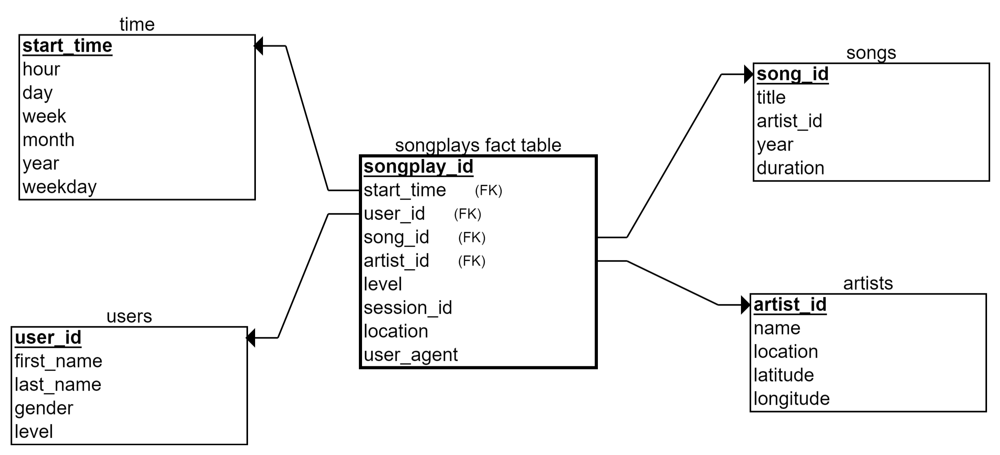

# Introduction
A music streaming startup, Sparkify, has grown their user base and song database and want to move their processes and data onto the cloud. Their data resides in S3, in a directory of JSON logs on user activity on the app, as well as a directory with JSON metadata on the songs in their app.

In this project I built:
- an ETL pipeline that extracts their data from S3, stages them in Redshift, and transforms data into a set of dimensional tables for their analytics team to continue finding insights in what songs their users are listening to. 
- an test script to test the database and ETL pipeline by running queries given to me by the analytics team from Sparkify and compare the results with their expected results.

# Data Understanding
I worked with two datasets that reside in S3. Here are the S3 links for each:
- Song data: `s3://udacity-dend/song_data`
- Log data: `s3://udacity-dend/log_data`
- Log data json path: `s3://udacity-dend/log_json_path.json`

## Song Dataset
The first dataset is a subset of real data from the Million Song Dataset. Each file is in JSON format and contains metadata about a song and the artist of that song. The files are partitioned by the first three letters of each song's track ID. For example, here are filepaths to two files in this dataset.
- `song_data/A/B/C/TRABCEI128F424C983.json`
- `song_data/A/A/B/TRAABJL12903CDCF1A.json`

And below is an example of what a single song file, `TRAABJL12903CDCF1A.json`, looks like.

```python
{"num_songs": 1, "artist_id": "ARJIE2Y1187B994AB7", "artist_latitude": null, "artist_longitude": null, 
 "artist_location": "", "artist_name": "Line Renaud", "song_id": "SOUPIRU12A6D4FA1E1", 
 "title": "Der Kleine Dompfaff", "duration": 152.92036, "year": 0}
```

## Log Dataset
The second dataset consists of log files in JSON format generated by this event simulator based on the songs in the dataset above. These simulate app activity logs from an imaginary music streaming app based on configuration settings.
The log files in the dataset you'll be working with are partitioned by year and month. For example, here are filepaths to two files in this dataset.
- `log_data/2018/11/2018-11-12-events.json`
- `log_data/2018/11/2018-11-13-events.json`

And below is an example of what the data in a log file, `2018-11-12-events.json`, looks like.


# Project steps

1. First I had to design the schemas for the facts and dimensions, below you can find the star-schema:




2. The next step was to implement this schema design into  `sql_queries.py` with the SQL statements. 

3. Then I added the keys, secrets, passwords etc. to my local `dwh.cfg` file. I did not included this one to this repo but the template is like:

```
[CLUSTER]
HOST=
DWH_DB=<YOUR DB NAME>
DWH_DB_USER=<YOUR DB USER>
DWH_DB_PASSWORD=<YOUR DB PASSWORD>
DWH_PORT=<YOUR PORT>
DWH_CLUSTER_TYPE=multi-node
DWH_NUM_NODES=4
DWH_NODE_TYPE=dc2.large

[IAM_ROLE]
ARN=

[S3]
LOG_DATA='s3://udacity-dend/log_data'
LOG_JSONPATH='s3://udacity-dend/log_json_path.json'
SONG_DATA='s3://udacity-dend/song_data'

[AWS]
KEY=<YOUR AWS KEY>
SECRET=<YOUR AWS SECRET>
```

4. I launched a Redshift cluster by running a self made python script: `create_red_shift_cluster.py` this script also writes the `HOST` and `ARN` to the configuration file

5. Create the tables on the `HOST` (Redshift) by running `create_tables.py`. 

6. Extract, Transform and Load by running `etl.py`
    1. Importing the metadata of the staging tables, the fact and dimensions from `sql_queries`
    2. Copying the song and log data into the staging tables 
    3. Selecting and Inserting the staging tables into the fact and dimensions

7. Then I checked the output of the analytics queries from `sql_queries.py` by running `check_output_tables.py`

|                   | count |
|-------------------|-------|
| Staging events    | 8056  |
| Staging songs     | 14896 |
| Dimension Artists | 10025 |
| Dimension Songs   | 14896 |
| Dimension Time    | 8023  |
| Dimension Users   | 104   |
| Fact Song plays   | 33    |


8. Off course in the end we should not forget to delete the cluster by running `delete_redshift_cluster.py`:
