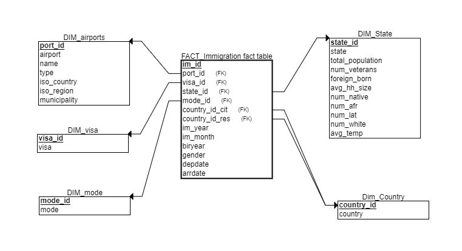

# Nanodegree Data Engineering Capstone Project: Relationship between several factors and US immigration events

## Project Summary
Project to get analytic table to show relationship between several factors and US immigration events. The final output are 5 dimensional tables connected in a star-schema:

All steps are described in the provided notebook `ND_DE_Capstone_Project.ipynb`
