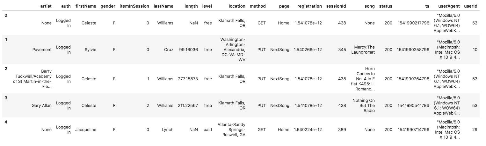
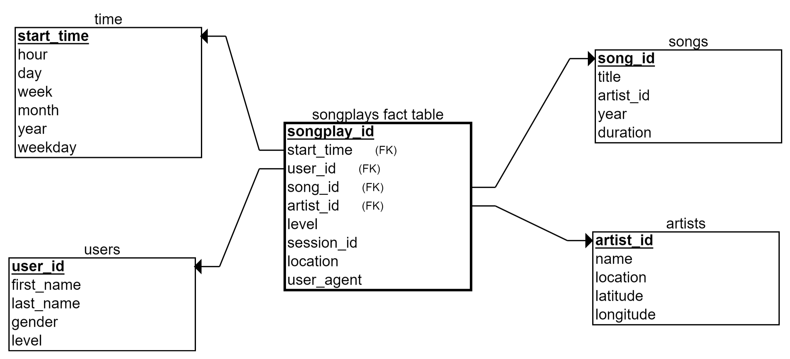

# Project Data Lake

## Introduction
A music streaming startup, Sparkify, has grown their user base and song database and want to move their processes and data onto the cloud. Their data resides in S3, in a directory of JSON logs on user activity on the app, as well as a directory with JSON metadata on the songs in their app.

In this project I built:
- An ETL pipeline that extracts the data from S3, processes it with Spark and loads the data back into S3 as a set of dimensional tables. 

## Data Understanding
I worked with two datasets that reside in S3. Here are the S3 links for each:
- Song data: `s3://udacity-dend/song_data`
- Log data: `s3://udacity-dend/log_data`

### Song Dataset
The first dataset is a subset of real data from the Million Song Dataset. Each file is in JSON format and contains metadata about a song and the artist of that song. The files are partitioned by the first three letters of each song's track ID. For example, here are filepaths to two files in this dataset.
- `song_data/A/B/C/TRABCEI128F424C983.json`
- `song_data/A/A/B/TRAABJL12903CDCF1A.json`

And below is an example of what a single song file, `TRAABJL12903CDCF1A.json`, looks like.

```python
{"num_songs": 1, "artist_id": "ARJIE2Y1187B994AB7", "artist_latitude": null, "artist_longitude": null, 
 "artist_location": "", "artist_name": "Line Renaud", "song_id": "SOUPIRU12A6D4FA1E1", 
 "title": "Der Kleine Dompfaff", "duration": 152.92036, "year": 0}
```

### Log Dataset
The second dataset consists of log files in JSON format generated by this event simulator based on the songs in the dataset above. These simulate app activity logs from an imaginary music streaming app based on configuration settings.
The log files in the dataset you'll be working with are partitioned by year and month. For example, here are filepaths to two files in this dataset.
- `log_data/2018/11/2018-11-12-events.json`
- `log_data/2018/11/2018-11-13-events.json`

And below is an example of what the data in a log file, `2018-11-12-events.json`, looks like.


# Project steps
1. First I added the AWS key and secrets to my local `dl.cfg` file. I also specify my output location in S3. I did not included this one to this repo but the template is like:
```
AWS_ACCESS_KEY_ID='<my_aws_access_key>'
AWS_SECRET_ACCESS_KEY='<my_aws_secret_access_key>'
OUTPUT_S3='<my_s3_output_bucket>'
```

2. Then I had to design the schemas for the facts and dimensions, below you can find the star-schema:


3. The next step was to implement this schema design into  `etl.py`. This ETL consist of two functions:
	1. `process_song_data`: Extracts the data from the Song Dataset and creates two dimensional tables: (1) `songs_table` and (2) `artists_table`
	2. `process_log_data`: Extracts the data from the Log Dataset and creates the other dimensional tables: (3) `user_table`, (4) `time_table`, and (5) the fact `songplays_table`
The output is written to the predefined output bucket in parquet format. 

4. I launched a EMR cluster with PySpark installed and logged in via SSH. 

5. Copied the local file to the root of this EMR cluster and runned the command `python etl.py`
