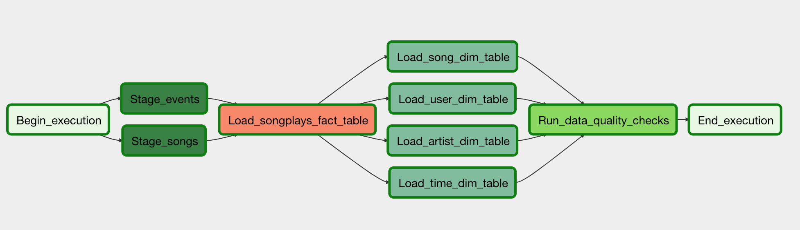

# Data Pipelines with Airflow
A music streaming company, Sparkify, has decided that it is time to introduce more automation and monitoring to their data warehouse ETL pipelines and come to the conclusion that the best tool to achieve this is Apache Airflow.
They have decided to bring you into the project and expect you to create high grade data pipelines that are dynamic and built from reusable tasks, can be monitored, and allow easy backfills. They have also noted that the data quality plays a big part when analyses are executed on top the data warehouse and want to run tests against their datasets after the ETL steps have been executed to catch any discrepancies in the datasets.
The source data resides in S3 and needs to be processed in Sparkify's data warehouse in Amazon Redshift. The source datasets consist of JSON logs that tell about user activity in the application and JSON metadata about the songs the users listen to.


# Project Steps
Before running any dags I assume that there are already tables in Redshift database with the columns as described in `create_tables.sql`. In the provided template I missed the time table, so I added this one to the script.

1. First step was to set the dependencies of the steps in the DAG. This dag (named 'sparkify-songplays-analysis') had the following dependencies:
```python
start_operator >> stage_events_to_redshift
start_operator >> stage_songs_to_redshift
stage_events_to_redshift >> load_songplays_table
stage_songs_to_redshift >> load_songplays_table

load_songplays_table >> load_user_dimension_table
load_songplays_table >> load_song_dimension_table
load_songplays_table >> load_artist_dimension_table
load_songplays_table >> load_time_dimension_table

load_user_dimension_table >> run_quality_checks
load_song_dimension_table >> run_quality_checks
load_artist_dimension_table >> run_quality_checks
load_time_dimension_table >> run_quality_checks

run_quality_checks >> end_operator
```

Leading to the following graph:



2. Next step was to configure the different operators
	- `stage_redshift.py`:  Loads any JSON formatted files from S3 to Amazon Redshift. The operator creates and runs a SQL COPY statement based on the parameters (a source `s3_key` and a destination `table` in redshift) provided. 
	- `load_fact`: Loads the data from staging tables and creates a fact table `songplays` in redshift
	- `load_dimensions.py`: Loads the data from the staging tables and creates dimension tables in redshift (`users`, `artists`, `songs`, `time`)
	- `data_quality`: Checks if certain column contains NULL values by counting all the rows that have NULL in the column. We do not want to have any NULLs so expected result would be 0 and the test would compare the SQL statement's outcome to the expected result.

3. Then I runned the Airflow server and configured the `aws_credentials` and the `redshift` connection in the tab connections in Airflow UI. 

4. Finnaly triggered the job. 